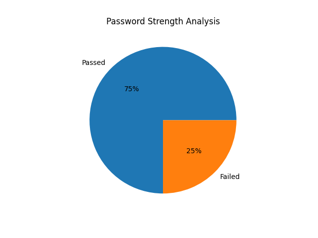

# 🔐 Password Strength Analyzer

A Python program that checks the strength of a password using multiple conditions and displays the result with a score and a pie chart visualization.

## 🚀 Features
- Password strength checking (Weak / Medium / Strong)
- Strength score system (0–4)
- Colored terminal output 🎨
- Pie chart visualization 📊
- Saves chart as image file 🖼

## 🛠 Built With
- Python
- re module
- Colorama
- Matplotlib

## 📦 Installation

Install required libraries:

pip install colorama matplotlib

## ▶️ How to Run

1. Download or clone the repository  
2. Open the project folder  
3. Run the program  

python password_checker.py

## 💡 Example Output

🔍 Password Strength Checker  

Enter your password: Parth@123  

Strength Score: 4/4  
Strength: Strong ✅  

## 📊 Output Chart

## 📂 Project Structure

password-strength-analyzer  
│  
├── password_checker.py  
├── password_strength_chart.png  
└── README.md  

## 👨‍💻 Author
Parth Rawat
